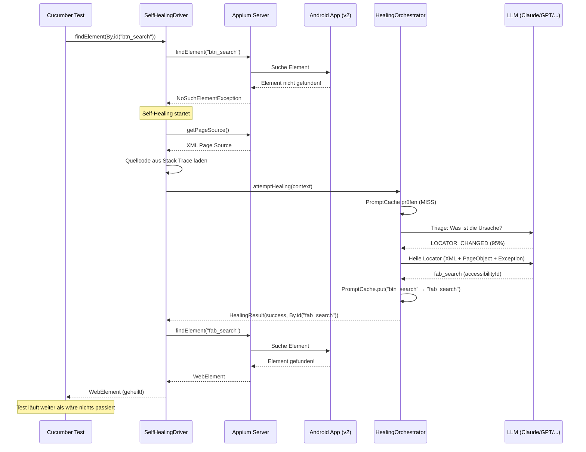
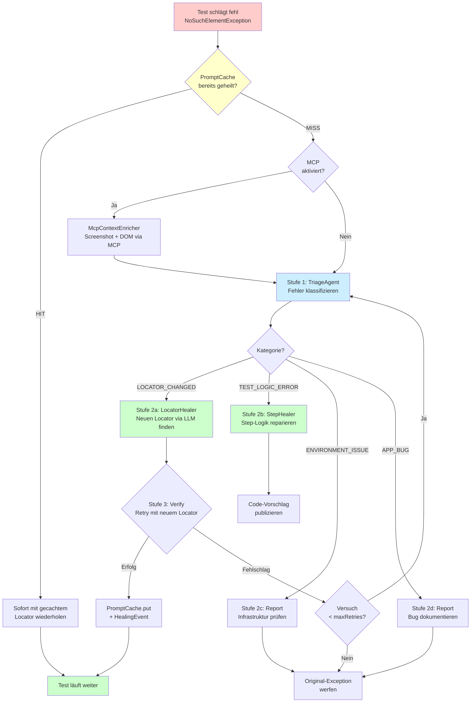

# Appium Self-Healing

> KI-basiertes Self-Healing für mobile Appium-Tests mit Spring AI Agents

Dieses Projekt demonstriert, wie **LLM-basierte Agenten** fehlschlagende Appium-Tests zur Laufzeit automatisch reparieren können. Wenn sich die Oberfläche einer App ändert (z.B. neue UI-Version), erkennt das System den Fehler, klassifiziert die Ursache und heilt den Test — alles während der Testausführung.

## Inhaltsverzeichnis

- [Konzept](#konzept)
- [Demo-App: Zugverbindung](#demo-app-zugverbindung)
- [Ausführung](#ausführung)
- [Architektur](#architektur)
- [Healing-Pipeline](#healing-pipeline)
- [Projektstruktur](#projektstruktur)
- [Technologie-Stack](#technologie-stack)
- [LLM-Benchmark](#llm-benchmark)
- [Konfiguration](#konfiguration)
- [Test-Ergebnisse](TEST-RESULTS.md) — Detaillierte Ergebnisse aller Test-Runs (v1, v2, multi-LLM, verify-fix)

---

## Konzept

### Das Problem

UI-Tests brechen häufig — nicht wegen Bugs in der App, sondern wegen **Änderungen in der Oberfläche**: umbenannte Element-IDs, neue Layouts, geänderte Navigation. Die Pflege dieser Tests ist aufwendig und fehleranfällig.

### Die Lösung

Eine **Agent-Pipeline aus 4 LLM-Agenten und 2 regelbasierten Handlern** analysiert jeden Testfehler, klassifiziert die Ursache (Locator | Umgebung | Bug | Test-Logik) und heilt oder reportet — anschließend wird mit dem geheilten Locator erneut versucht. Detail-Flowchart unter [Healing-Pipeline](#healing-pipeline). Das System unterstützt verschiedene LLMs (Claude, GPT, Mistral, lokal) und ermöglicht den direkten Vergleich ihrer Self-Healing-Fähigkeiten.

### Ablauf einer Self-Healing-Demo



---

## Demo-App: Zugverbindung

Die Demo-App zeigt Zugverbindungen zwischen deutschen Bahnhöfen. Zwei UI-Versionen demonstrieren den Self-Healing-Mechanismus:

### v1 → v2 Locator-Änderungen

v1 ist eine Einzelseiten-App mit Standard-IDs; v2 hat einen separaten Ergebnis-Screen, einen FAB statt Button, neue testTags und ein BottomSheet mit Detailansicht.

| Element | v1 (testTag) | v2 (testTag) | Änderungstyp | Heal-Schwierigkeit |
|---------|-------------|-------------|---------------|-------------------|
| Startbahnhof | `input_from` | `departure_station` | ID-Rename | Einfach |
| Zielbahnhof | `input_to` | `arrival_station` | ID-Rename | Einfach |
| Suchbutton | `btn_search` | `fab_search` | Widget-Typ (Button → FAB) | Mittel |
| Ergebnisliste | `connection_list` | `results_container` | ID + separate Seite | Schwer |
| Verbindung | `connection_item` | `journey_card` | Struktur (Column → Row) | Schwer |
| Abfahrt | `text_from` | `label_departure` | ID-Rename | Einfach |
| Ziel | `text_to` | `label_arrival` | ID-Rename | Einfach |
| Umstiege | `text_transfers` | `label_changes` | ID + Format-Änderung | Mittel |
| Preis | `text_price` | `label_fare` | Widget-Typ (Text → Badge) | Mittel |
| Keine Ergebnisse | `text_no_results` | `empty_state_text` | ID + separate Seite | Schwer |
| Tauschen-Button | — | `btn_swap` | Neu in v2 | — |
| Detail-Sheet | — | `detail_sheet` | Neu in v2 | — |
| Filter-Action (Position 0) | `btn_m3n` (TextButton) | `toolbar_action` (IconButton, Trichter-Icon) | ID + Widget-Typ + ID-Kollision | **Vision-affin** |
| Sort-Action (Position 1) | `btn_x7q` (TextButton) | `toolbar_action` (IconButton, Sortier-Icon) | ID + Widget-Typ + ID-Kollision | **Vision-affin** |
| Share-Action (Position 2) | `btn_p2k` (TextButton) | `toolbar_action` (IconButton, Share-Icon) | ID + Widget-Typ + ID-Kollision | **Vision-affin** |
| Toolbar-Status | `toolbar_status` | `toolbar_status` | unverändert (Verifikations-Anker) | — |

> **Vision-affine Locator-Kollision:** Die drei Toolbar-Aktionen in v2 teilen sich denselben `testTag` (`toolbar_action`) und dieselbe `content-description` (`Aktion`). Im XML-Page-Source sind sie ununterscheidbar — der einzige Diskriminator ist das gerenderte Icon-Glyph (Trichter / Sortier-Pfeile / Share-Symbol). Die v1-Locatoren heißen bewusst `btn_m3n` / `btn_x7q` / `btn_p2k` (semantisch entkoppelt **und** unalphabetisch), damit der broken-Locator-Name dem LLM weder Zweck noch Position über die Suffix-Sortierung verrät. Verifikation läuft über den `toolbar_status`-Text, der nach erfolgreichem Klick zeigt, welche Aktion tatsächlich ausgelöst wurde — ein falscher Heal schlägt damit auf der Assertion fehl, nicht erst bei `NoSuchElementException`.

---

## Ausführung

### Voraussetzungen

- Docker + Docker Compose
- Mindestens ein LLM API-Key (oder LM Studio für lokale Ausführung)
- Optional: Android SDK (nur zum Bauen der APKs)

> **Hinweis (Windows/WSL2):** Der Docker-basierte Android-Emulator benötigt **Nested Virtualization (KVM)**. Setup-Anleitung siehe [docker/PODMAN.md → Schritt 1](docker/PODMAN.md#1-kvm-in-der-podman-wsl2-maschine-aktivieren). Ohne KVM schlägt der Emulator-Start fehl.

### 1. API-Keys konfigurieren

```bash
cp docker/.env.example docker/.env
# Datei bearbeiten und API-Key(s) eintragen
```

### 2. Android-APKs bauen (einmalig)

```bash
cd android-app
./gradlew assembleV1Debug assembleV2Debug
cd ..
```

Erzeugt:
- `android-app/app/build/outputs/apk/v1/debug/app-v1-debug.apk`
- `android-app/app/build/outputs/apk/v2/debug/app-v2-debug.apk`

### 3. Tests ausführen

```bash
# v1-Tests gegen v1-App (Baseline — alles grün)
./scripts/run-tests.sh v1

# v1-Tests gegen v2-App (Self-Healing wird ausgelöst!)
./scripts/run-tests.sh v2

# Mit anderem LLM-Provider
./scripts/run-tests.sh v2 openai
./scripts/run-tests.sh v2 mistral
./scripts/run-tests.sh v2 local

# Auf Podman statt Docker
./scripts/run-tests-podman.sh v2
```

Nach dem Testlauf sind die Ergebnisse unter `build/reports/` verfügbar:

```bash
build/reports/
├── cucumber-v1.html   # Report für v1-Lauf (bleibt erhalten)
├── cucumber-v1.json
├── cucumber-v2.html   # Report für v2-Lauf (bleibt erhalten)
├── cucumber-v2.json
├── cucumber.html      # Immer der letzte Lauf
└── cucumber.json
```

Jeder Report enthält **Screenshots der App** nach jedem Szenario — so lässt sich der Endzustand der Oberfläche direkt im Report nachvollziehen. Bei v2 zeigen die Screenshots die geheilte App nach erfolgreichem Self-Healing.

Die versionsspezifischen Reports (`cucumber-v1.html`, `cucumber-v2.html`) werden automatisch nach jedem Lauf erzeugt, sodass v1- und v2-Reports sich nicht gegenseitig überschreiben.

#### Highlight-Feature: Rote Markierung geheilter Elemente

Die App nutzt `Modifier.healableTestTag()` (statt `Modifier.testTag()`) — ein Custom-Modifier, der nach erfolgreichem Heal einen **3 dp roten Border** um das geheilte Element zeichnet. Der `SelfHealingAppiumDriver` sendet einen Android-Broadcast (`de.keiss.selfhealing.HIGHLIGHT`), wartet 500 ms auf die Compose-Animation, macht einen Screenshot und hängt ihn ans Cucumber-Szenario an. Nach 3 s (`HIGHLIGHT_DURATION_MS`) wird der Border automatisch entfernt. Dadurch sind die geheilten Elemente sowohl im Cucumber-HTML-Report als auch live im noVNC sichtbar.

> **Tipp:** Während die Tests laufen, kann der Emulator live im Browser unter [http://localhost:6080](http://localhost:6080) (noVNC) beobachtet werden — so lässt sich der Ablauf in der App in Echtzeit verfolgen.

### Manuell starten (ohne Docker)

Backend (`./gradlew :backend:bootRun`), Appium (`appium --relaxed-security`) und Emulator separat starten, App via `adb install` installieren, dann Tests via `./gradlew :integration-tests:test -Dappium.url=http://localhost:4723 -Dspring.profiles.active=anthropic` mit gesetztem API-Key ausführen.

---

## Architektur

Das Projekt kombiniert zwei Integrationsmuster — **Decorator** auf Test-Ebene (`SelfHealingAppiumDriver` umwickelt `AppiumDriver`, Tests laufen mit voller Geschwindigkeit), **MCP-Client** auf Agent-Ebene (Spring AI verbindet sich zum offiziellen `appium/appium-mcp`-Server für Screenshots und DOM-Exploration). LLM-Calls erfolgen nur bei Fehlern.

Architekturdetails und Optionsabwägung siehe [ADR-001](ADR-001-appium-self-healing-architecture.md).

---

## Healing-Pipeline

### Pipeline-Übersicht

Die Healing-Pipeline besteht aus **4 LLM-basierten Agenten** und **2 regelbasierten Handlern**:

| Komponente | Typ | Beschreibung |
|------------|-----|-------------|
| `McpContextEnricher` | LLM-Agent | Kontext-Anreicherung via Appium MCP-Tools (Screenshot, DOM, Element-Exploration) |
| `TriageAgent` | LLM-Agent | Fehler-Klassifikation (Locator, Step, Umgebung, App-Bug) |
| `LocatorHealer` | LLM-Agent | Findet alternativen Locator via LLM + DOM-Analyse |
| `StepHealer` | LLM-Agent | Repariert Step-Logik via LLM |
| `EnvironmentChecker` | Regelbasiert | HTTP Health Checks gegen Backend und Appium (kein LLM) |
| `AppBugReporter` | Regelbasiert | Strukturierter Bug-Report mit Screenshot (kein LLM) |

Koordiniert werden sie vom `HealingOrchestrator`, der selbst keinen LLM-Call macht.

### Ablauf im Detail



### Triage-Kategorien

| Kategorie | Beschreibung | Automatisch heilbar? | Indikatoren |
|-----------|-------------|---------------------|------------|
| `LOCATOR_CHANGED` | Element-ID wurde umbenannt | **Ja** (zur Laufzeit) | `NoSuchElementException`, Locator-ID nicht im Page Source |
| `TEST_LOGIC_ERROR` | Test-Logik stimmt nicht mehr | **Teilweise** (Code-Vorschlag) | `AssertionError`, falscher Screen |
| `ENVIRONMENT_ISSUE` | Infrastruktur-Problem | **Nein** (Report) | `ConnectionRefused`, Timeout, leerer Page Source |
| `APP_BUG` | Funktionaler Bug in der App | **Nein** (Report) | Element gefunden, aber falsche Daten |

---

## Projektstruktur

| Modul | Inhalt |
|---|---|
| `backend/` | Spring Boot REST-API (`GET /api/v1/connections`, statische Demo-Daten) |
| `android-app/` | Jetpack Compose App, Build-Flavors `v1`/`v2` mit divergierenden testTags |
| `self-healing-core/` | Wiederverwendbare Healing-Bibliothek — Agenten, Orchestrator, Driver-Decorator, Prompt-Creators (Komponenten siehe [Healing-Pipeline](#healing-pipeline)) |
| `self-healing-a2a/` | A2A-Modul (Server + Client), siehe [docs/a2a-phase5-protocol.md](docs/a2a-phase5-protocol.md) |
| `integration-tests/` | Cucumber-Tests (deutsche Steps), Page Objects mit v1-Locatoren |
| `benchmark/` | Multi-Provider Benchmark-Runner mit `tracks/*.yaml` (EASY/MEDIUM/HARD) |
| `docker/` | `docker-compose.yml` + Dockerfiles für Backend und Test-Runner; Podman-Setup-Anleitung |
| `docs/` | Architektur- und Protokoll-Detaildokumente (MCP-Vergleich, A2A-Protokoll) |
| `scripts/` | Convenience-Skripte: `run-tests.sh`, `run-tests-podman.sh`, `verify-fix.sh` |
| `config/` | Build-/Style-Konfiguration (Eclipse-Formatter) |

---

## Technologie-Stack

| Komponente | Technologie | Version |
|-----------|------------|---------|
| Sprache (Backend + Tests) | Java | 25 |
| Sprache (Android-App) | Kotlin + Jetpack Compose | 2.1.20 |
| Build | Gradle (Kotlin DSL) | 9.4.1 |
| Backend | Spring Boot | 4.0.5 |
| AI-Framework | Spring AI | 2.0.0-M4 |
| MCP-Server | appium/appium-mcp (offiziell) | latest |
| Test-Framework | Cucumber | 7.34.3 |
| Mobile-Automation | Appium Java Client | 10.1.0 |
| Android-SDK | compileSdk 36, minSdk 28 | API 36 |
| Container | Docker Compose | - |
| Android-Emulator | budtmo/docker-android | emulator_14.0 |

### Unterstützte LLM-Provider

| Provider | Profil | Modell | Einsatz |
|----------|--------|--------|---------|
| Anthropic | `anthropic` (`anthropic-vision`) | `claude-sonnet-4-6` | Standard (bestes Codeverständnis), Vision-fähig |
| OpenAI | `openai` | `gpt-4.1` | Alternative |
| Mistral | `mistral` | `codestral-latest` | Code-spezialisiert |
| Lokal generisch | `local` | LM Studio (`LM_STUDIO_MODEL`) | Offline, kostenfrei |
| Lokal vorkonfiguriert | `local-qwen3-30b`, `local-devstral`, `local-qwen3-next`, `local-glm-4-7-flash` | siehe [LM-Studio-Tabelle](#lokale-llms-mit-lm-studio) | Offline, mit Modell-spezifischen Tunings |

---

## LLM-Benchmark

Das Benchmark-Modul vergleicht verschiedene LLMs anhand definierter Teststrecken.

### Teststrecken

Drei Schwierigkeitsstufen aus `benchmark/src/main/resources/tracks/*.yaml`: **EASY** (reine ID-Renames, 5 Heals, max 15 s), **MEDIUM** (Widget-Typ- und Layout-Änderungen, 7 Heals, max 30 s), **HARD** (Navigations- und Flow-Änderungen, 9 Heals, max 60 s).

### Benchmark ausführen

```bash
# Alle LLMs vergleichen (Docker-basiert — benötigt Emulator + Backend)
./scripts/run-tests.sh benchmark

# Oder manuell per Docker
cd docker
docker compose --profile benchmark up --build benchmark-runner

# Gradle-basierte Orchestrierung (lokal, ohne Docker-Wrapper)
./gradlew benchmarkAll                                    # alle Provider
./gradlew benchmarkAll -PllmProviders=anthropic,local     # Teilmenge
```

**Wie es funktioniert** — `benchmarkAll` führt `:integration-tests:test` einmal pro
LLM-Provider aus. Jeder Lauf aktiviert den `HealingMetricsCollector` via
`benchmark.enabled=true` und schreibt ein JSON-Fragment
(`build/reports/benchmark/<provider>-<track>.json`) mit allen gesammelten
`HealingEvent`s. Am Ende lädt `:benchmark:bootRun` alle Fragmente, aggregiert
sie zu einem vergleichenden `BenchmarkReport` und druckt die Provider-Tabelle.
Die jeweiligen API-Keys (`ANTHROPIC_API_KEY`, `OPENAI_API_KEY`, `MISTRAL_API_KEY`)
bzw. eine lokale LM-Studio-Instanz müssen gesetzt sein.

### Lokale LLMs mit LM Studio

Neben den Cloud-Providern können lokale Modelle über **LM Studio** eingebunden werden. Das Framework unterstützt drei vorkonfigurierte Profile:

| Profil | Modell | Größe (GGUF) | Empf. Quantisierung |
|---|---|---|---|
| `local-qwen3-next` | qwen3-coder-next | 48 GB | Q4_K_M |
| `local-devstral` | devstral-small-2-2512 | 15 GB | Q4_K_M / Q8 |
| `local-qwen3-30b` | qwen3-coder-30b | 19 GB | Q4_K_M |
| `local-glm-4-7-flash` | zai-org/glm-4.7-flash (Reasoning) | ~16 GB | Q4_K_M |

#### Voraussetzungen

1. [LM Studio](https://lmstudio.ai) herunterladen und installieren
2. Modell laden: **Discover → Modellname suchen → Download**
3. LM Studio-Server starten: **Developer → Start Server** (Port 1234)
4. Modell-Identifier prüfen: im LM Studio-Server-Log oder unter `GET http://localhost:1234/v1/models` — der zurückgegebene `id`-Wert muss mit dem Profilnamen übereinstimmen

> **Hinweis:** Falls der Modell-Identifier in LM Studio abweicht (z.B. vollständiger Dateiname), kann er über die Umgebungsvariable `LM_STUDIO_MODEL` im generischen `local`-Profil überschrieben werden.

#### Einzel-Test (lokal, ohne Docker)

```bash
# Ein bestimmtes Modell testen
LLM_PROVIDER=local-qwen3-30b ./gradlew :integration-tests:test

# Mehrere lokale Modelle nacheinander (Gradle)
./gradlew benchmarkAll -PllmProviders=local-qwen3-30b,local-devstral,local-glm-4-7-flash
```

#### Benchmark mit Docker Compose

LM Studio läuft auf dem Host-Rechner; Docker erreicht es über `host.docker.internal`:

```bash
# .env anpassen:
# LLM_PROVIDER=local-qwen3-30b
# LM_STUDIO_URL=http://host.docker.internal:1234   ← wird automatisch gesetzt

cd docker
docker compose up test-runner --build

# Oder alle lokalen Modelle im Benchmark-Lauf:
docker compose --profile benchmark up --build benchmark-runner
```

Der `benchmark-runner` durchläuft automatisch die konfigurierten Provider. Lokale Modelle benötigen keine API-Keys, müssen aber in LM Studio aktiv geladen sein.

### Gemessene Metriken

| Metrik | Beschreibung |
|--------|-------------|
| `healing_success_rate` | Anteil erfolgreich geheilter Locatoren |
| `avg_healing_time_ms` | Durchschnittliche Healing-Dauer pro Locator |
| `total_llm_tokens` | Gesamtverbrauch an LLM-Tokens |
| `total_llm_cost_usd` | Geschätzte Kosten pro Lauf |
| `false_positive_rate` | Fälschlich als geheilt markierte Locatoren |

### Aktuelle Test-Ergebnisse

Die kanonische Übersicht aller Test-Läufe (Cloud + lokal, MCP-Vergleich, verify-fix) liegt in [TEST-RESULTS.md](TEST-RESULTS.md). Letzte Ausführung: **20.04.2026** — alle sechs Provider (Anthropic, OpenAI, Mistral, Qwen3-Coder-30B, Devstral Small 2, GLM-4.7-Flash) heilen 6/6 Szenarien des `@very-hard-navigation`-Tracks.

> **Hinweis zum Anthropic Prompt-Caching:** Konfiguriert via `cache-options.strategy: system-only`, jedoch zeigten alle Calls `creation: 0, read: 0` Tokens — die System-Prompts (~600–800 Tokens) liegen unterhalb der Mindestgröße von Anthropic (~1024 Tokens). Das In-Memory-`PromptCache` kompensiert dies innerhalb einer Test-Session (typische Hit-Rate: 60–70 %).

---

## Konfiguration

### Self-Healing Properties

```yaml
self-healing:
  enabled: true              # Self-Healing global an/aus
  max-retries: 3             # Max. Heilungsversuche pro Locator
  llm-provider: anthropic    # Aktiver LLM-Provider
  source-base-path: ./       # Pfad zu Java-Quelldateien
  triage:
    enabled: true            # Triage-Stufe (false = direkt heilen)
  mcp:
    enabled: false           # MCP-Kontext-Anreicherung
```

### LLM-Provider wechseln

```bash
# Per Umgebungsvariable
LLM_PROVIDER=openai ./scripts/run-tests.sh v2

# Per Spring-Profil
./gradlew :integration-tests:test -Dspring.profiles.active=mistral

# Lokal mit LM Studio
LLM_PROVIDER=local ./scripts/run-tests.sh v2
```

### PR-Erstellung für geheilte Locatoren

Wenn ein Locator-Heal erfolgreich war, kann der Self-Healing-Agent automatisch einen Fix-Branch + GitHub-PR mit dem reparierten Page-Object öffnen. Workflow:

1. `HealingResult` mit fixedSource → `AutoFixPrCreator` (`@EventListener`)
2. `GitService` (JGit): Branch `fix/self-healing-<PageClass>-<timestamp>` aus `base-branch`, schreibt Datei, commit, push
3. `GitHubPrService` (kohsuke/github-api): öffnet PR mit strukturiertem Body (Original- + Healed-Locator, Reason, Provider, Scenario)

**Dry-Run-Modus** (`SELF_HEALING_GIT_PR_DRY_RUN=true`): logt Branch-Name, Commit-Message, PR-Body und liefert eine `dry-run://...`-URL — ohne JGit/GitHub-API-Aufruf. Empfohlen für die Erstverifikation neuer Provider/Modelle.

#### Env-Vars

```bash
SELF_HEALING_GIT_PR_ENABLED=true
SELF_HEALING_GIT_PR_DRY_RUN=true            # erst false, wenn dry-run sauber durchläuft
SELF_HEALING_GIT_PR_BASE_BRANCH=self-healing-playground
SELF_HEALING_SOURCE_BASE_PATH=<git-root>    # Git-Root, NICHT das Submodul-Verzeichnis
GITHUB_TOKEN=<personal-access-token>        # repo-scope
GITHUB_REPO_OWNER=dkeiss
GITHUB_REPO_NAME=appium-self-healing
SPRING_PROFILES_ACTIVE=anthropic,selfhealing # oder local-devstral,selfhealing
```

#### Stolperfallen

- **`SPRING_PROFILES_ACTIVE` muss als Env-Var gesetzt werden**, nicht als `-Dspring.profiles.active`. [integration-tests/src/test/resources/application.yml](integration-tests/src/test/resources/application.yml) referenziert `${SPRING_PROFILES_ACTIVE:anthropic}` — der `-D`-Flag erreicht den Test-Fork nicht.
- **`SELF_HEALING_SOURCE_BASE_PATH` muss auf das Git-Root zeigen**, nicht auf das Submodul (`integration-tests`). JGit würde sonst versuchen, das Submodul-Verzeichnis als Repo zu öffnen und mit `repository not found` scheitern. [SourceCodeResolver](self-healing-core/src/main/java/de/keiss/selfhealing/core/driver/SourceCodeResolver.java) und [GitService](self-healing-core/src/main/java/de/keiss/selfhealing/core/git/GitService.java) probieren `<sub>/src/test/java/` und `<sub>/src/main/java/` automatisch ab.
- **Triage** ruft das LLM ebenfalls auf. Bei lokalen Modellen (Devstral) sollte `selfhealing.triage.enabled=false` gesetzt oder ein Anthropic-Dummy-Key gestellt werden, sonst schlägt die Triage-Stufe vor dem Heal fehl.
- **Verifiziert mit** Anthropic Claude Sonnet sowie lokalem Devstral Small 2 (LM Studio, OpenAI-kompatibel).

### Vision-Healing (Screenshot als Heal-Input)

Wenn `self-healing.vision.enabled=true` (oder Profil `anthropic-vision`), hängt der `LocatorHealer` den Failure-Screenshot als PNG-`Media`-Anhang an die Heal-Prompt. Hilft bei mehrdeutigen XML-Hierarchien (z. B. mehreren Buttons mit ähnlichen resource-ids) — der LLM kann das Element visuell anhand von Label, Icon oder Layout-Position disambiguieren.

```bash
SPRING_PROFILES_ACTIVE=anthropic-vision,selfhealing
# oder explizit per Env-Var auf einem anderen Provider:
SELF_HEALING_VISION_ENABLED=true
```

**Voraussetzung:** Vision-fähiges Modell — verifiziert für Anthropic Claude Sonnet 4.6 (Profil `anthropic-vision`). GPT-4.1 (`openai`) und Qwen3-VL-Varianten unterstützen es ebenfalls. Nicht-Vision-Modelle (Devstral, Mistral Codestral, GLM-4.7-Flash) ignorieren das Image bzw. lehnen es ab — Flag dort ausgeschaltet lassen.

Der Screenshot wird ohnehin schon im `FailureContext` mitgeführt (für Debug-Reports). Vision-Modus aktiviert nur das Anhängen ans LLM-Prompt — keine zusätzliche Capture-Operation.

### Docker-Services

| Service | Port | Beschreibung |
|---------|------|-------------|
| `android-emulator` | 6080 (noVNC), 4723 (Appium) | Android Emulator mit Appium |
| `backend` | 8080 | Zugverbindungs-API |
| `appium-mcp` | — | MCP-Sidecar (Profil: `mcp`) |
| `test-runner` | — | Cucumber-Tests |
| `benchmark-runner` | — | Multi-LLM-Vergleich (Profil: `benchmark`) |

---

## Roadmap

Phasen 1–4 vollständig umgesetzt; Phase 5 weitgehend abgeschlossen (PR-Erstellung, Vision-Healing, A2A-Modul live), iOS offen. Detail-Status siehe [ADR-001 — Action Items](ADR-001-appium-self-healing-architecture.md#action-items).

---

## Referenz

Dieses Projekt baut auf den Konzepten von [AICurator](https://github.com/dkeiss/aicurator) auf — einem Selenium-basierten Self-Healing-Framework mit Spring AI. Die Kernidee (Decorator-Pattern + LLM-Healing) wird hier auf mobile Tests mit Appium erweitert und um Triage, MCP-Integration und LLM-Benchmarking ergänzt.
