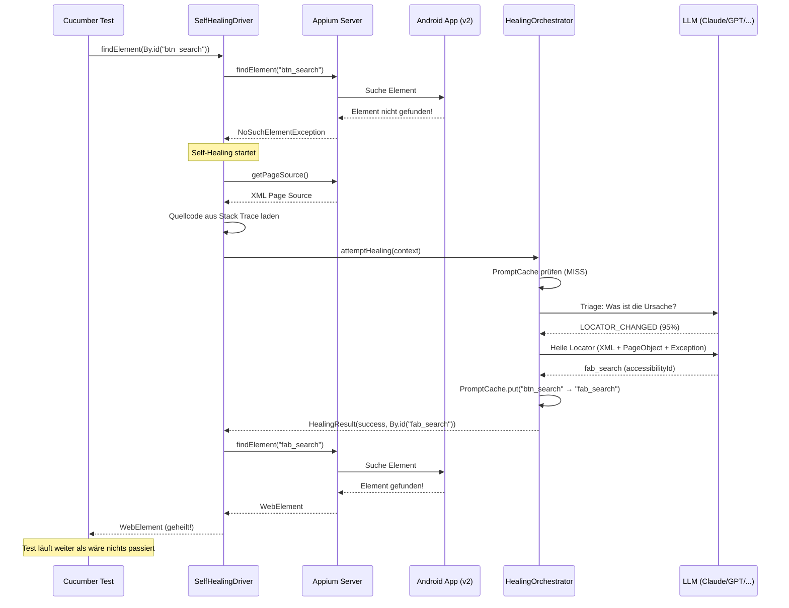
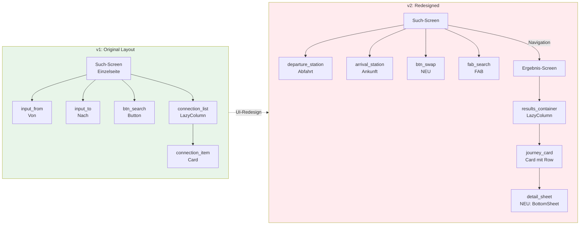
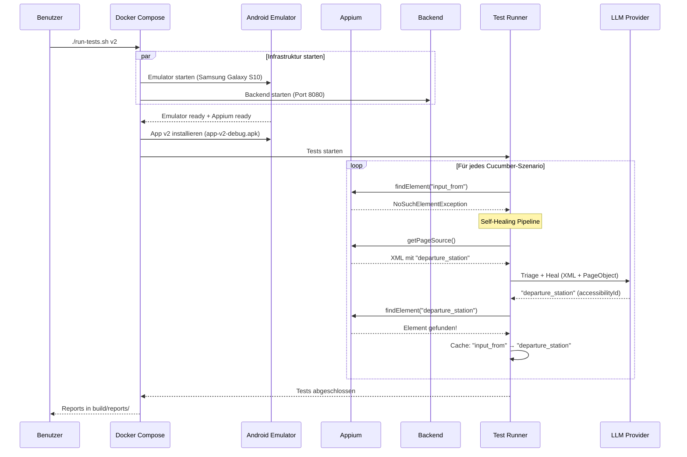
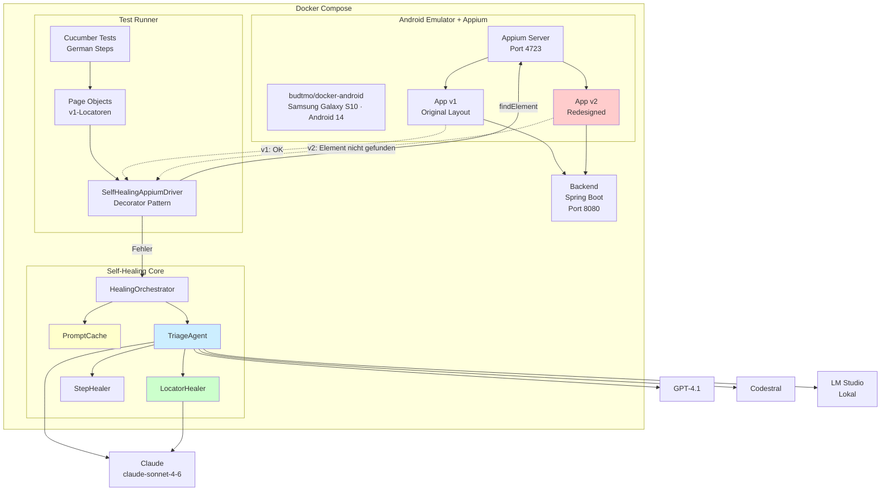
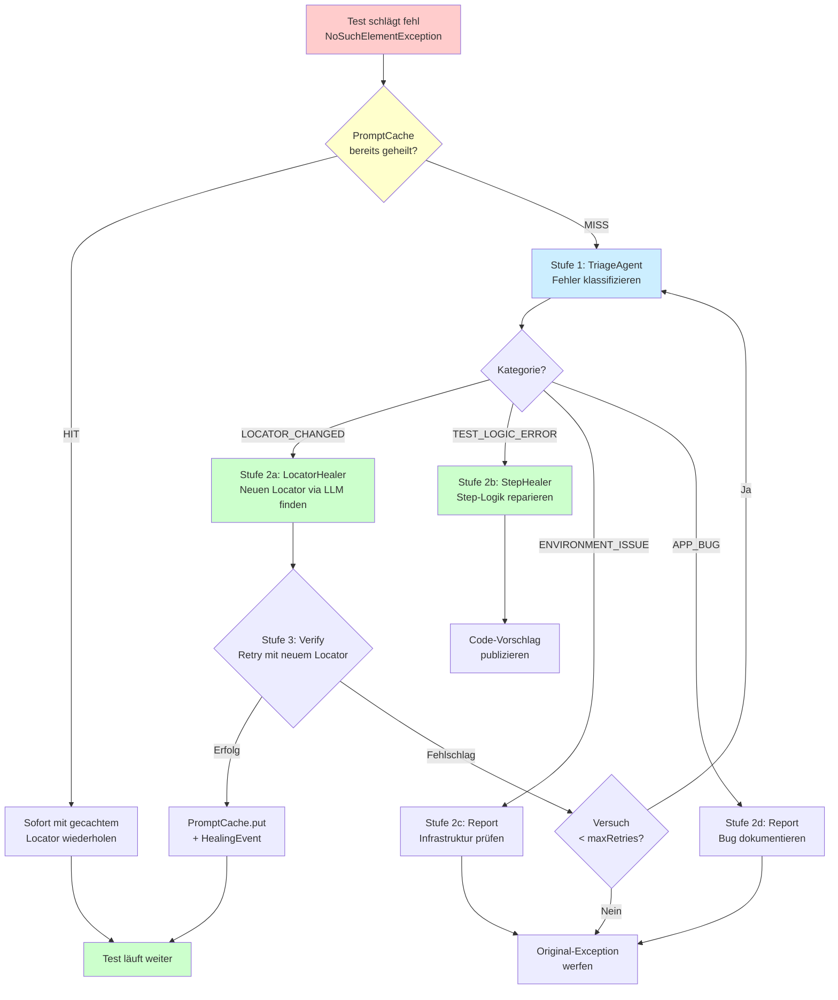

# Appium Self-Healing

> KI-basiertes Self-Healing für mobile Appium-Tests mit Spring AI Agents

Dieses Projekt demonstriert, wie **LLM-basierte Agenten** fehlschlagende Appium-Tests zur Laufzeit automatisch reparieren können. Wenn sich die Oberfläche einer App ändert (z.B. neue UI-Version), erkennt das System den Fehler, klassifiziert die Ursache und heilt den Test — alles während der Testausführung.

## Inhaltsverzeichnis

- [Konzept](#konzept)
- [Demo-App: Zugverbindung](#demo-app-zugverbindung)
- [Ausführung](#ausführung)
- [Architektur](#architektur)
- [Healing-Pipeline](#healing-pipeline)
- [Projektstruktur](#projektstruktur)
- [Technologie-Stack](#technologie-stack)
- [LLM-Benchmark](#llm-benchmark)
- [Konfiguration](#konfiguration)
- [Fix-Verifikation](#fix-verifikation-mit-verify-fixsh) — Baseline vs. Fix-Branch via `verify-fix.sh`
- [Test-Ergebnisse](TEST-RESULTS.md) — Detaillierte Ergebnisse aller Test-Runs (v1, v2, multi-LLM, verify-fix)

---

## Konzept

### Das Problem

UI-Tests brechen häufig — nicht wegen Bugs in der App, sondern wegen **Änderungen in der Oberfläche**: umbenannte Element-IDs, neue Layouts, geänderte Navigation. Die Pflege dieser Tests ist aufwendig und fehleranfällig.

### Die Lösung

Eine **Agent-Pipeline aus 4 LLM-Agenten und 2 regelbasierten Handlern** analysiert jeden Testfehler, klassifiziert die Ursache und repariert den Test automatisch:

```
     Test schlägt fehl
            │
            ▼
   ┌─────────────────┐
   │  1. TRIAGE      │  Was ist die Ursache?
   │     Agent       │  → Locator | Umgebung | Bug | Test-Logik
   └────────┬────────┘
            │
   ┌────────┴─────────────────────┐
   │                              │
   ▼                              ▼
┌──────────┐              ┌──────────────┐
│ 2. HEAL  │              │ 2. REPORT    │
│  Locator/│              │  Bug/Umgebung│
│  Step Fix│              │  (kein Fix)  │
└─────┬────┘              └──────────────┘
      │
      ▼
┌──────────┐
│ 3. VERIFY│  Healed Locator → Retry → Erfolg?
└──────────┘
```

Das System unterstützt **verschiedene LLMs** (Claude, GPT, Mistral, lokal) und ermöglicht den **direkten Vergleich** ihrer Self-Healing-Fähigkeiten.

### Ablauf einer Self-Healing-Demo



---

## Demo-App: Zugverbindung

Die Demo-App zeigt Zugverbindungen zwischen deutschen Bahnhöfen. Zwei UI-Versionen demonstrieren den Self-Healing-Mechanismus:

### v1 vs. v2 Änderungen



### Detaillierte Locator-Änderungen

| Element | v1 (testTag) | v2 (testTag) | Änderungstyp | Heal-Schwierigkeit |
|---------|-------------|-------------|---------------|-------------------|
| Startbahnhof | `input_from` | `departure_station` | ID-Rename | Einfach |
| Zielbahnhof | `input_to` | `arrival_station` | ID-Rename | Einfach |
| Suchbutton | `btn_search` | `fab_search` | Widget-Typ (Button → FAB) | Mittel |
| Ergebnisliste | `connection_list` | `results_container` | ID + separate Seite | Schwer |
| Verbindung | `connection_item` | `journey_card` | Struktur (Column → Row) | Schwer |
| Abfahrt | `text_from` | `label_departure` | ID-Rename | Einfach |
| Ziel | `text_to` | `label_arrival` | ID-Rename | Einfach |
| Umstiege | `text_transfers` | `label_changes` | ID + Format-Änderung | Mittel |
| Preis | `text_price` | `label_fare` | Widget-Typ (Text → Badge) | Mittel |
| Keine Ergebnisse | `text_no_results` | `empty_state_text` | ID + separate Seite | Schwer |
| Tauschen-Button | — | `btn_swap` | Neu in v2 | — |
| Detail-Sheet | — | `detail_sheet` | Neu in v2 | — |

---

## Ausführung

### Voraussetzungen

- Docker + Docker Compose
- Mindestens ein LLM API-Key (oder LM Studio für lokale Ausführung)
- Optional: Android SDK (nur zum Bauen der APKs)

#### KVM-Aktivierung (Windows / WSL2)

Der Docker-basierte Android-Emulator benötigt **Nested Virtualization (KVM)**. Unter WSL2 muss diese explizit aktiviert werden:

1. Datei `C:\Users\<DEIN_USER>\.wslconfig` erstellen/ergänzen:

   ```ini
   [wsl2]
   nestedVirtualization=true
   ```

2. WSL neu starten:

   ```powershell
   wsl --shutdown
   ```

3. Prüfen, ob KVM verfügbar ist:

   ```bash
   ls -la /dev/kvm
   ```

   Wenn `/dev/kvm` vorhanden ist, kann der Android-Emulator im Docker-Container starten.

> **Hinweis:** Ohne KVM schlägt der Emulator-Container fehl mit `Could not find a connected Android device`. Die Health-Checks von Docker Compose laufen durch, aber der Emulator bootet kein virtuelles Gerät.

### 1. API-Keys konfigurieren

```bash
cp docker/.env.example docker/.env
# Datei bearbeiten und API-Key(s) eintragen
```

### 2. Android-APKs bauen (einmalig)

```bash
cd android-app
./gradlew assembleV1Debug assembleV2Debug
cd ..
```

Erzeugt:
- `android-app/app/build/outputs/apk/v1/debug/app-v1-debug.apk`
- `android-app/app/build/outputs/apk/v2/debug/app-v2-debug.apk`

### 3. Tests ausführen

```bash
# v1-Tests gegen v1-App (Baseline — alles grün)
./run-tests.sh v1

# v1-Tests gegen v2-App (Self-Healing wird ausgelöst!)
./run-tests.sh v2

# Mit anderem LLM-Provider
./run-tests.sh v2 openai
./run-tests.sh v2 mistral
./run-tests.sh v2 local
```

Nach dem Testlauf sind die Ergebnisse unter `build/reports/` verfügbar:

```bash
build/reports/
├── cucumber-v1.html   # Report für v1-Lauf (bleibt erhalten)
├── cucumber-v1.json
├── cucumber-v2.html   # Report für v2-Lauf (bleibt erhalten)
├── cucumber-v2.json
├── cucumber.html      # Immer der letzte Lauf
└── cucumber.json
```

Jeder Report enthält **Screenshots der App** nach jedem Szenario — so lässt sich der Endzustand der Oberfläche direkt im Report nachvollziehen. Bei v2 zeigen die Screenshots die geheilte App nach erfolgreichem Self-Healing.

Die versionsspezifischen Reports (`cucumber-v1.html`, `cucumber-v2.html`) werden automatisch nach jedem Lauf erzeugt, sodass v1- und v2-Reports sich nicht gegenseitig überschreiben.

> **Tipp:** Während die Tests laufen, kann der Emulator live im Browser unter [http://localhost:6080](http://localhost:6080) (noVNC) beobachtet werden — so lässt sich der Ablauf in der App in Echtzeit verfolgen.

### 4. Was passiert beim Self-Healing-Lauf?



### Manuell starten (ohne Docker)

```bash
# 1. Backend starten
./gradlew :backend:bootRun

# 2. Appium separat starten
appium --relaxed-security

# 3. App auf Emulator/Gerät installieren
adb install android-app/app/build/outputs/apk/v2/debug/app-v2-debug.apk

# 4. Tests ausführen
ANTHROPIC_API_KEY=sk-ant-... \
./gradlew :integration-tests:test \
    -Dappium.url=http://localhost:4723 \
    -Dspring.profiles.active=anthropic
```

### Fix-Verifikation mit `verify-fix.sh`

Wenn ein Fix-Branch (z.B. aus einer Auto-Fix-PR oder manuelle Page-Object-Anpassung) verifiziert werden soll, vergleicht `verify-fix.sh` die v2-Tests auf `master` (Baseline) gegen den Fix-Branch:

```bash
# Vergleicht master vs feature/update-page-objects
./verify-fix.sh feature/update-page-objects

# Mit anderem LLM-Provider
./verify-fix.sh feature/update-page-objects openai
```

**Voraussetzungen:**
- `jq` muss installiert sein (`choco install jq` / `brew install jq`)
- Der angegebene Branch muss lokal existieren
- Lokale Änderungen werden automatisch gestasht und nach dem Lauf wiederhergestellt

**Was passiert:**
1. Infrastruktur (Emulator + Backend + Forwarder) wird **einmalig** gestartet — bleibt zwischen den Läufen aktiv
2. `git checkout master` → v2-Tests laufen → `build/reports/verify/cucumber-baseline.json`
3. `git checkout <fix-branch>` → v2-Tests laufen → `build/reports/verify/cucumber-fix.json`
4. Szenario-für-Szenario-Vergleich mit Markern: `[FIXED]`, `[REGRESSION]`, `[OK]`, `[STILL FAILING]`

**Beispiel-Ausgabe:**

```
╔══════════════════════════════════════════════════╗
║  Verification Results                            ║
╠══════════════════════════════════════════════════╣
║  Baseline:  3/5 passed, 2 failed                 ║
║  Fix:       5/5 passed, 0 failed                 ║
╠══════════════════════════════════════════════════╣
║  Scenario Comparison:                            ║
║    [OK]            Direkte Verbindung finden     ║
║    [OK]            Verbindung mit Umstieg        ║
║    [OK]            Keine Verbindung gefunden     ║
║    [FIXED]         Einfache ID-Änderung wird... ║
║    [FIXED]         Verbindungssuche mit Umst... ║
╚══════════════════════════════════════════════════╝
```

Reports landen unter `build/reports/verify/cucumber-baseline.html` und `cucumber-fix.html`.

> **Optimierung:** Da Emulator und Backend zwischen den beiden Läufen weiterlaufen, wird nur der `test-runner`-Container neu gebaut — Ersparnis ~3-5 Minuten pro Verifikation.

---

## Architektur

### Gesamtarchitektur



### Decorator-Ansatz

Das Projekt nutzt den Decorator-Pattern für die Integration:

| Schicht | Muster | Einsatz |
|---------|--------|---------|
| **Test-Ausführung** | Decorator Pattern | `SelfHealingAppiumDriver` umwickelt `AppiumDriver` — Tests laufen schnell mit nativem Client |
| **Healing-Agent** | Spring AI ChatClient | Direkter LLM-Call mit atomar im `FailureContext` gesammeltem Kontext (Page Source + Screenshot + Page-Object-Source) |

**Vorteile:**
- Im Normalfall (kein Fehler) läuft der Test mit voller Geschwindigkeit
- LLM wird **nur bei Fehlern** aufgerufen
- Vollständiger Kontext wird einmalig vom Decorator gesammelt — deterministisch, cache-freundlich, gut für Benchmarking

> **Hinweis zu MCP:** Eine frühere Version verfolgte einen Hybrid-Ansatz mit
> `appium/appium-mcp` als Sidecar. Dieser wurde entfernt — siehe
> [ADR-002](ADR-002-remove-mcp-integration.md) für die Begründung
> (Healing ist ein bounded task, MCP-Tool-Loops kollidieren mit dem
> deterministischen Benchmarking-Ziel).

---

## Healing-Pipeline

### Pipeline-Übersicht

Die Healing-Pipeline besteht aus **3 LLM-basierten Agenten** und **2 regelbasierten Handlern**:

| Komponente | Typ | Beschreibung |
|------------|-----|-------------|
| `TriageAgent` | LLM-Agent | Fehler-Klassifikation (Locator, Step, Umgebung, App-Bug) |
| `LocatorHealer` | LLM-Agent | Findet alternativen Locator via LLM + DOM-Analyse |
| `StepHealer` | LLM-Agent | Repariert Step-Logik via LLM |
| `EnvironmentChecker` | Regelbasiert | HTTP Health Checks gegen Backend und Appium (kein LLM) |
| `AppBugReporter` | Regelbasiert | Strukturierter Bug-Report mit Screenshot (kein LLM) |

Koordiniert werden sie vom `HealingOrchestrator`, der selbst keinen LLM-Call macht.

### Ablauf im Detail



### Triage-Kategorien

| Kategorie | Beschreibung | Automatisch heilbar? | Indikatoren |
|-----------|-------------|---------------------|------------|
| `LOCATOR_CHANGED` | Element-ID wurde umbenannt | **Ja** (zur Laufzeit) | `NoSuchElementException`, Locator-ID nicht im Page Source |
| `TEST_LOGIC_ERROR` | Test-Logik stimmt nicht mehr | **Teilweise** (Code-Vorschlag) | `AssertionError`, falscher Screen |
| `ENVIRONMENT_ISSUE` | Infrastruktur-Problem | **Nein** (Report) | `ConnectionRefused`, Timeout, leerer Page Source |
| `APP_BUG` | Funktionaler Bug in der App | **Nein** (Report) | Element gefunden, aber falsche Daten |

---

## Projektstruktur

```
appium-self-healing/
│
├── backend/                              Spring Boot REST-API
│   └── controller/ConnectionController   GET /api/v1/connections?from=X&to=Y
│   └── service/ConnectionService         7 Demo-Verbindungen
│   └── model/Connection                  Abfahrt, Ankunft, Umsteigen, Preis, Legs
│
├── android-app/                          Jetpack Compose App (Kotlin)
│   └── app/src/main/                     Shared: MainActivity, Data Layer, Theme
│   └── app/src/v1/                       v1-Flavor: Einzelseite, Original-IDs
│   └── app/src/v2/                       v2-Flavor: Zwei Screens, neue IDs + FAB
│
├── self-healing-core/                    Wiederverwendbare Healing-Bibliothek
│   ├── agent/TriageAgent                 LLM-Agent: Fehler-Klassifikation
│   ├── healing/LocatorHealer             LLM-Agent: Locator-Reparatur
│   ├── healing/StepHealer                LLM-Agent: Step-Logik-Reparatur
│   ├── healing/EnvironmentChecker        Regelbasiert: HTTP Health Checks
│   ├── healing/AppBugReporter            Regelbasiert: Bug-Report + Screenshot
│   ├── healing/HealingOrchestrator       Orchestriert Pipeline (kein LLM)
│   ├── healing/PromptCache               Caching (kein doppelter LLM-Call)
│   ├── driver/SelfHealingAppiumDriver    Decorator um AppiumDriver
│   ├── driver/SourceCodeResolver         Liest PageObject-Code aus Stack Trace
│   ├── prompt/LocatorPromptCreator       Appium-optimierte Prompts
│   ├── prompt/StepPromptCreator          Step-Level Prompts
│   ├── prompt/TriagePromptCreator        Klassifikations-Prompts
│   ├── model/                            FailureContext, HealingResult, HealingEvent, ...
│   └── config/                           AutoConfiguration + Properties
│
├── integration-tests/                    Cucumber + Appium Tests
│   ├── features/connection_search        3 Szenarien (direkt, Umstieg, leer)
│   ├── features/self_healing             2 Szenarien mit Healing-Report
│   ├── pages/SearchPage                  Page Object (v1-Locatoren)
│   ├── pages/ResultPage                  Page Object (v1-Locatoren)
│   └── steps/                            Deutsche Cucumber-Steps
│
├── benchmark/                            LLM-Vergleichs-Framework
│   ├── BenchmarkRunner                   Orchestriert Teststrecken
│   ├── model/BenchmarkReport             Vergleichstabelle
│   └── tracks/*.yaml                     EASY / MEDIUM / HARD
│
├── docker/                               Docker Compose Setup
│   ├── docker-compose.yml                Emulator + Appium + Backend + Runner
│   ├── Dockerfile.backend                Backend-Image
│   └── Dockerfile.tests                  Test-Runner-Image
│
├── ADR-001-...architecture.md            Architecture Decision Record
├── TEST-RESULTS.md                       Test-Ergebnisse (multi-LLM, verify-fix)
├── run-tests.sh                          Convenience-Script
└── verify-fix.sh                         PR-Fix-Verifikation (Baseline vs. Branch)
```

---

## Technologie-Stack

| Komponente | Technologie | Version |
|-----------|------------|---------|
| Sprache (Backend + Tests) | Java | 25 |
| Sprache (Android-App) | Kotlin + Jetpack Compose | 2.1.20 |
| Build | Gradle (Kotlin DSL) | 9.4.1 |
| Backend | Spring Boot | 4.0.5 |
| AI-Framework | Spring AI | 2.0.0-M4 |
| Test-Framework | Cucumber | 7.34.3 |
| Mobile-Automation | Appium Java Client | 10.1.0 |
| Android-SDK | compileSdk 36, minSdk 28 | API 36 |
| Container | Docker Compose | - |
| Android-Emulator | budtmo/docker-android | emulator_14.0 |

### Unterstützte LLM-Provider

| Provider | Profil | Modell | Einsatz |
|----------|--------|--------|---------|
| Anthropic | `anthropic` | `claude-sonnet-4-6` | Standard (bestes Codeverständnis) |
| OpenAI | `openai` | `gpt-4.1` | Alternative |
| Mistral | `mistral` | `codestral-latest` | Code-spezialisiert |
| Lokal | `local` | LM Studio (beliebig) | Offline, kostenfrei |

---

## LLM-Benchmark

Das Benchmark-Modul vergleicht verschiedene LLMs anhand definierter Teststrecken.

### Teststrecken

```mermaid
graph LR
    subgraph EASY["EASY: ID-Renames"]
        E1[input_from → departure_station]
        E2[input_to → arrival_station]
        E3[btn_search → fab_search]
        E4[connection_list → results_container]
        E5[text_from → label_departure]
    end

    subgraph MEDIUM["MEDIUM: Struktur-Änderungen"]
        M1["Button → FAB<br/>(Widget-Typ)"]
        M2["List Item → Card<br/>(Layout-Änderung)"]
        M3["Text → Badge<br/>(Widget-Typ)"]
    end

    subgraph HARD["HARD: Navigation"]
        H1["Einzelseite → Zwei Screens<br/>(Navigation-Änderung)"]
        H2["Inline-Ergebnis → Separater Screen<br/>(Flow-Änderung)"]
    end

    EASY -->|5 Healings<br/>max 15s| MEDIUM
    MEDIUM -->|7 Healings<br/>max 30s| HARD
    HARD -->|9 Healings<br/>max 60s| RESULT[Vergleichsbericht]

    style EASY fill:#c8e6c9
    style MEDIUM fill:#fff9c4
    style HARD fill:#ffcdd2
```



### Benchmark ausführen

```bash
# Alle LLMs vergleichen (Docker-basiert — benötigt Emulator + Backend)
./run-tests.sh benchmark

# Oder manuell per Docker
cd docker
docker compose --profile benchmark up --build benchmark-runner

# Gradle-basierte Orchestrierung (lokal, ohne Docker-Wrapper)
./gradlew benchmarkAll                                    # alle Provider
./gradlew benchmarkAll -PllmProviders=anthropic,local     # Teilmenge
```

**Wie es funktioniert** — `benchmarkAll` führt `:integration-tests:test` einmal pro
LLM-Provider aus. Jeder Lauf aktiviert den `HealingMetricsCollector` via
`benchmark.enabled=true` und schreibt ein JSON-Fragment
(`build/reports/benchmark/<provider>-<track>.json`) mit allen gesammelten
`HealingEvent`s. Am Ende lädt `:benchmark:bootRun` alle Fragmente, aggregiert
sie zu einem vergleichenden `BenchmarkReport` und druckt die Provider-Tabelle.
Die jeweiligen API-Keys (`ANTHROPIC_API_KEY`, `OPENAI_API_KEY`, `MISTRAL_API_KEY`)
bzw. eine lokale LM-Studio-Instanz müssen gesetzt sein.

### Gemessene Metriken

| Metrik | Beschreibung |
|--------|-------------|
| `healing_success_rate` | Anteil erfolgreich geheilter Locatoren |
| `avg_healing_time_ms` | Durchschnittliche Healing-Dauer pro Locator |
| `total_llm_tokens` | Gesamtverbrauch an LLM-Tokens |
| `total_llm_cost_usd` | Geschätzte Kosten pro Lauf |
| `false_positive_rate` | Fälschlich als geheilt markierte Locatoren |

### Erwartetes Ergebnis (Beispiel)

```
╔══════════════════════════════════════════════════════════════════════╗
║               LLM SELF-HEALING BENCHMARK REPORT                     ║
╠══════════════════════════════════════════════════════════════════════╣
║ Provider        │ Success% │   Avg ms │   Tokens │  Est. Cost ║
║─────────────────┼──────────┼──────────┼──────────┼────────────║
║ anthropic       │   92.0%  │  2300ms  │    12500 │   $0.0450  ║
║ openai          │   88.5%  │  1800ms  │    14200 │   $0.0710  ║
║ mistral         │   78.0%  │  1500ms  │    11800 │   $0.0120  ║
╠══════════════════════════════════════════════════════════════════════╣
║ Success Rate by Difficulty:                                         ║
║   anthropic:    EASY=100% MEDIUM=90% HARD=78%                       ║
║   openai:       EASY=100% MEDIUM=85% HARD=72%                       ║
║   mistral:      EASY=95%  MEDIUM=75% HARD=55%                       ║
╚══════════════════════════════════════════════════════════════════════╝
```

### Letzter Benchmark-Run: V2 Self-Healing mit Anthropic

> **Datum:** 08.04.2026 · **Modell:** `claude-sonnet-4-6` · **App-Version:** v2 · **Dauer:** 8 min 24 s

Alle 5 Szenarien bestanden (**5/5 PASSED**). Die Tests liefen gegen die
v2-App, die sämtliche Element-IDs gegenüber v1 umbenannt hat.
Das Self-Healing erkannte alle 8 Locator-Änderungen automatisch, ohne
Anpassung der Page Objects.

#### Geheilte Locatoren

| v1-Locator (Page Object) | v2-Locator (geheilt durch LLM) | Kategorie |
|--------------------------|-------------------------------|-----------|
| `input_from` | `departure_station` | EASY — ID-Rename |
| `input_to` | `arrival_station` | EASY — ID-Rename |
| `btn_search` | `fab_search` | MEDIUM — Widget-Typ (Button → FAB) |
| `connection_item` | `journey_card` | MEDIUM — Layout (List → Card) |
| `text_from` | `label_departure` | EASY — ID-Rename |
| `text_to` | `label_arrival` | EASY — ID-Rename |
| `text_transfers` | `label_changes` | EASY — ID-Rename |
| `text_no_results` | `empty_state_text` | EASY — ID-Rename |

#### Token-Verbrauch

| Agent | Aufrufe | Ø Prompt | Ø Completion | Ø Total | Gesamt |
|-------|---------|----------|-------------|---------|--------|
| Triage Agent | 8 | ~3.150 | ~113 | ~3.265 | 26.121 |
| LocatorHealer | 8 | ~6.082 | ~934 | ~6.891 | 55.131 |
| **Summe** | **16** | | | | **81.252** |

#### In-Memory PromptCache

| Metrik | Wert |
|--------|------|
| Cache Misses | 8 (je ein Call pro einzigartigem Locator) |
| Cache Hits | 16 (Folge-Szenarien nutzen gecachte Mappings) |
| Hit-Rate | 67 % |

> **Hinweis zum Anthropic Prompt-Caching:** Konfiguriert via `cache-options.strategy: system-only`,
> jedoch zeigten alle Calls `creation: 0, read: 0` Tokens. Die System-Prompts
> (~600–800 Tokens) liegen unterhalb der Mindestgröße von Anthropic (~1.024 Tokens).
> Das In-Memory-Caching kompensiert dies effektiv innerhalb einer Test-Session.

#### Szenarien

| # | Szenario | Ergebnis |
|---|----------|----------|
| 1 | Direkte Verbindung finden | ✅ PASSED |
| 2 | Verbindung mit Umstieg | ✅ PASSED |
| 3 | Keine Verbindung gefunden | ✅ PASSED |
| 4 | Einfache ID-Änderung wird geheilt | ✅ PASSED |
| 5 | Verbindungssuche mit Umstieg nach UI-Redesign | ✅ PASSED |

#### Regressions-Check (v1)

Anschließend liefen die gleichen Tests gegen die **v1-App** (unveränderte IDs) — ebenfalls **5/5 PASSED** in 2 min 31 s, ohne dass Self-Healing aktiv werden musste. Die Änderungen sind somit rückwärtskompatibel.

---

## Konfiguration

### Self-Healing Properties

```yaml
self-healing:
  enabled: true              # Self-Healing global an/aus
  max-retries: 3             # Max. Heilungsversuche pro Locator
  llm-provider: anthropic    # Aktiver LLM-Provider
  source-base-path: ./       # Pfad zu Java-Quelldateien
  triage:
    enabled: true            # Triage-Stufe (false = direkt heilen)
```

### LLM-Provider wechseln

```bash
# Per Umgebungsvariable
LLM_PROVIDER=openai ./run-tests.sh v2

# Per Spring-Profil
./gradlew :integration-tests:test -Dspring.profiles.active=mistral

# Lokal mit LM Studio
LLM_PROVIDER=local ./run-tests.sh v2
```

### Docker-Services

| Service | Port | Beschreibung |
|---------|------|-------------|
| `android-emulator` | 6080 (noVNC), 4723 (Appium) | Android Emulator mit Appium |
| `backend` | 8080 | Zugverbindungs-API |
| `test-runner` | — | Cucumber-Tests |
| `benchmark-runner` | — | Multi-LLM-Vergleich (Profil: `benchmark`) |

---

## Roadmap

- [x] **Phase 1**: Gradle-Monorepo, Backend, Page Objects, SelfHealingDriver, Cucumber-Tests
- [x] **Phase 2**: App v2, Prompt-Optimierung, StepHealer, Benchmark
- [x] **Phase 3**: Root-Cause-Analyse (EnvironmentChecker, AppBugReporter)
- [x] **Phase 4**: Benchmark-Automatisierung (vollständiger LLM-Vergleich)
- [ ] **Phase 5**: iOS, PR-Erstellung, Vision-Models, A2A-Integration

---

## Referenz

Dieses Projekt baut auf den Konzepten von [AICurator](https://github.com/dkeiss/aicurator) auf — einem Selenium-basierten Self-Healing-Framework mit Spring AI. Die Kernidee (Decorator-Pattern + LLM-Healing) wird hier auf mobile Tests mit Appium erweitert und um Triage, Root-Cause-Analyse und LLM-Benchmarking ergänzt.
